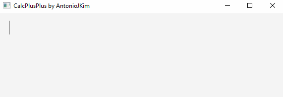

Interface
=========

Calculator UI
^^^^^^^^^^^^^

The graphical user interface that comes along with the CalcPlusPlus engine was purposefully designed to be as minimalistic and simple as possible.

As can be seen, when the UI is first booted up, it is a blank screen with a cursor blinking.

The design philosophy behind the UI is that of a simple document editor. You should be able to type multiple equations and have them be live evaluated.

Demo
^^^^

Custom Keyboard Shortcuts
^^^^^^^^^^^^^^^^^^^^^^^^^

``Ctrl + Enter`` to create a new equation editor

``Backspace / Delete`` on a blank line to delete it

``Ctrl + W`` to close the application

``Ctrl + H`` to open the docs

.. note::

   On Mac OS X, the above Keyboard shortcuts use the ``Command`` modifier key instead of ``Ctrl``
